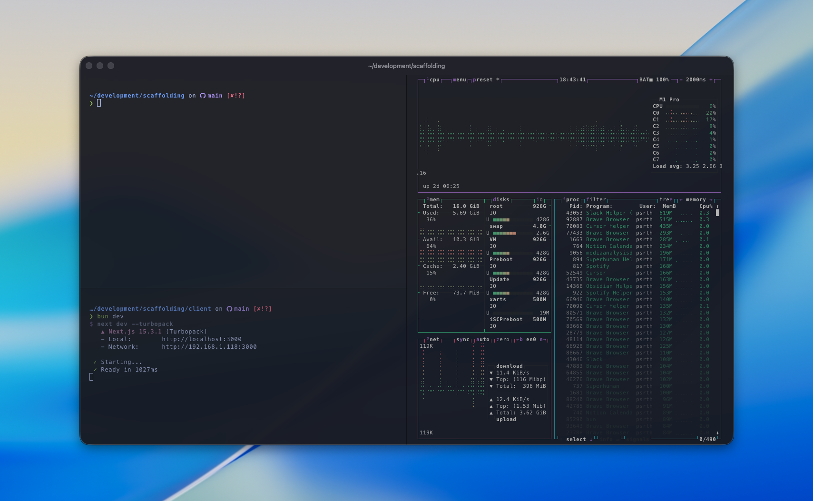

# dotfiles

[@psrth](https://github.com/psrth)'s opinionated dotfiles / machine setup for macOS.



## about

two foundational principles around this setup:

1. **always online**: all of my data is synced to the cloud in real-time, so i never have to worry about losing my computer _(no anon, that is not a good enough reason to steal my computer)_.
2. **light but functional**: configs should be minimal, maximizing functionality per mb.

## instructions

```bash
git clone https://github.com/psrth/dotfiles.git ~/.dotfiles
cd ~/.dotfiles
./setup.sh
```

the setup script will:

- install homebrew
- install all packages, apps, and cursor extensions
- install bun
- create symlinks for all dotfiles
- set zsh as default shell

## features

- **shell**: zsh with custom configuration
- **prompt**: starship
- **terminal**: ghostty
- **development tools**: git, go, python (uv), docker, etc.
- **apps**: cursor, brave, raycast, obsidian, figma, etc
- **extensions**: for cursor

## cloud sync

1. `dev`: sync from github
2. `icloud/obsidian`: sync vault from icloud
3. `desktop`: sync from google drive
4. `media`: icloud

## disclaimer

1. this is an extremeley opinionated setup designed just for me, and will most likely fight you if you don't follow my workflows.
2. if you only want the terminal setup, you can just copy the `ghostty_config`,`starship.toml`, and snippets from the `.zshrc` file.
3. the setup script is a destructive action meant only for fresh machines — it will overwrite your existing dotfiles. make sure to backup before running the script.
4. that being said — this setup is a breeze, takes 5 mins, will never use more than a couple gigs of storage, and will never slow down your machine. if you're brave enough, go for it.

## cheatsheet

```bash
# navigation
cd <dir>            # smart jump (zoxide)
z <query>           # jump to frecent dir
c                   # open cursor in cwd

# files
ls                  # list (eza)
ll                  # list detailed
lt                  # tree view
bat <file>          # cat with syntax highlighting
fd <pattern>        # find files
trash <file>        # safe delete

# git
g                   # git
fzf                 # fuzzy find (ctrl+r history, ctrl+t files)

# python (all via uv)
python / py         # uv run python
pip                 # uv pip

# config
zconfig             # edit .zshrc
reload              # source .zshrc

# npm is blocked — use bun or pnpm
```
